#!gabs gallery: Gabriel's Rice Gallery

# Rice Gallery

Here are some rices I made. I like ricing Unix systems!

## Cyberpunk DWM

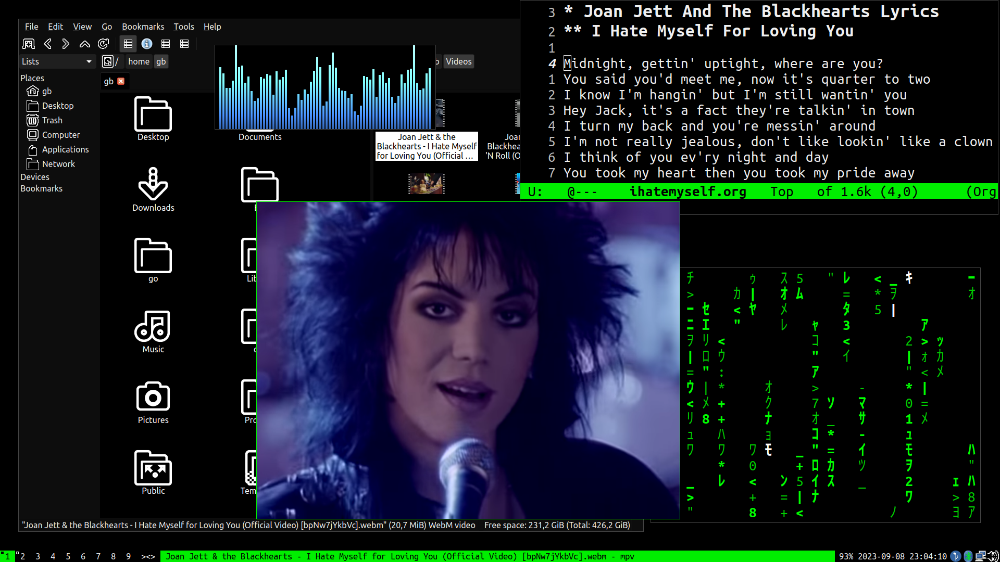

## Hatsune Miku OS

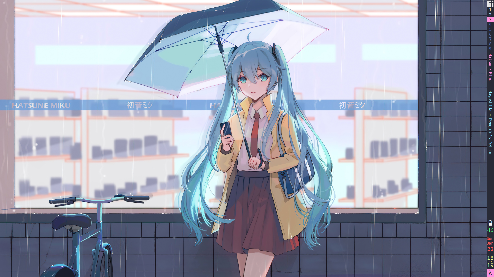

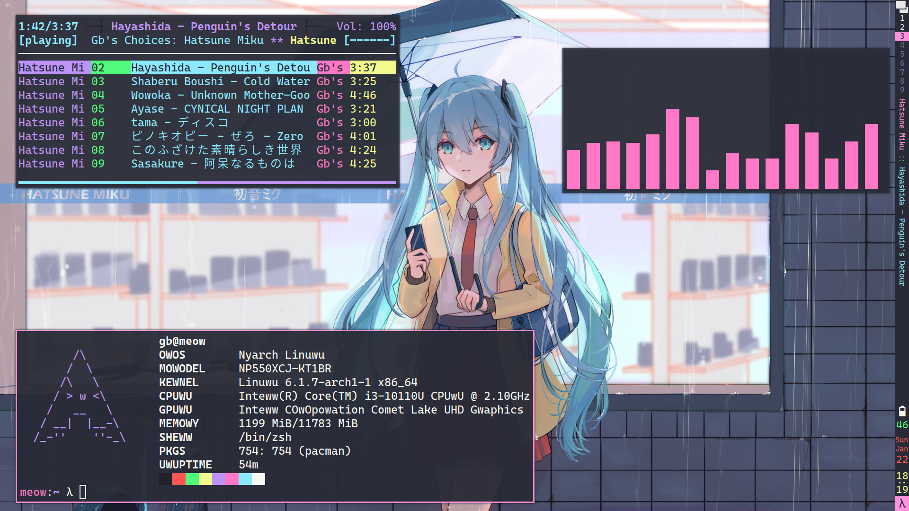

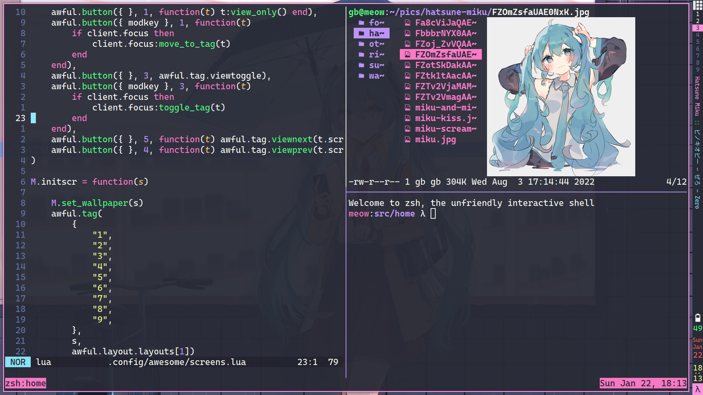

## Dracula Awesome

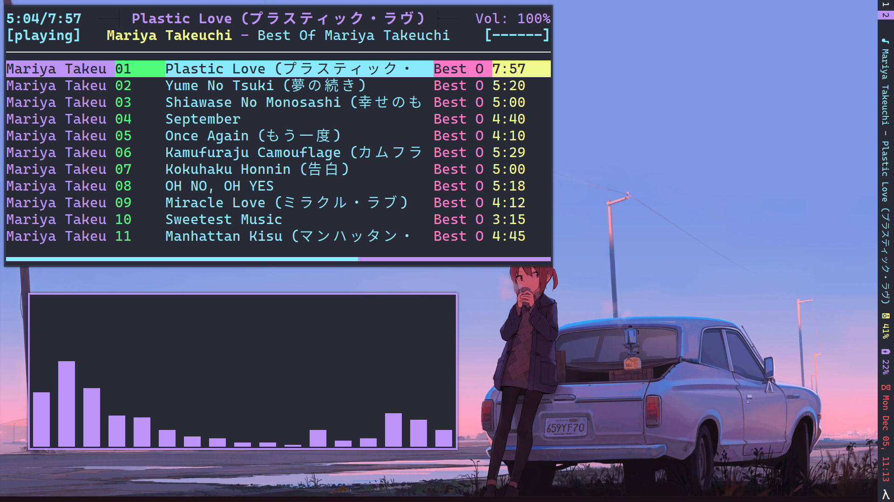

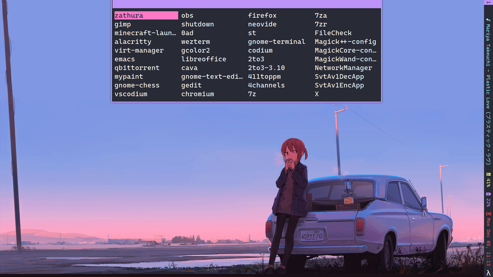

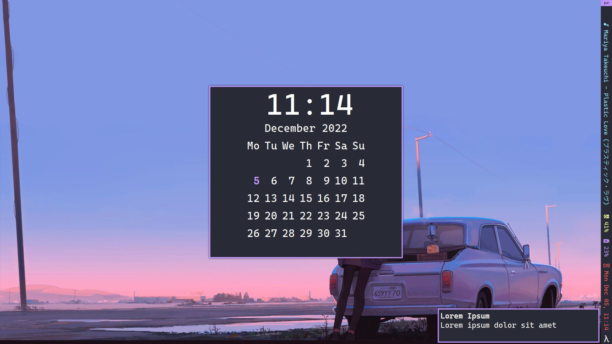

## Catppuccin Sway

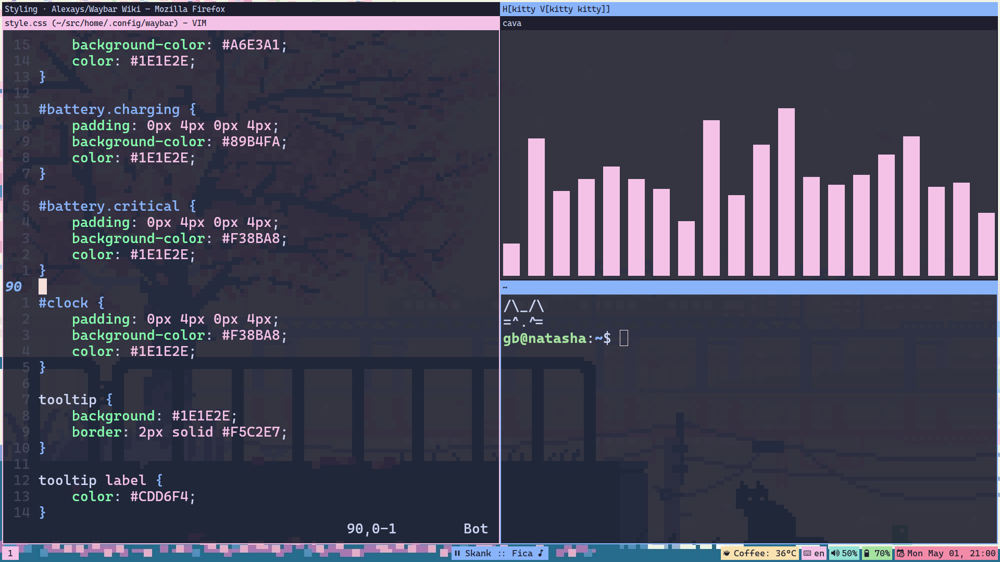

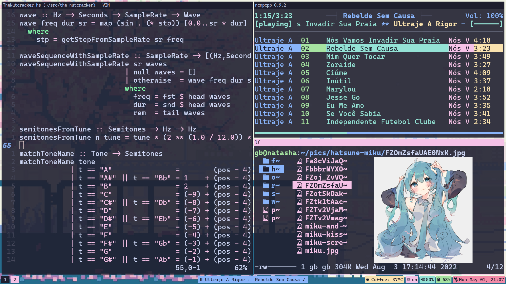

## Dracula XMonad

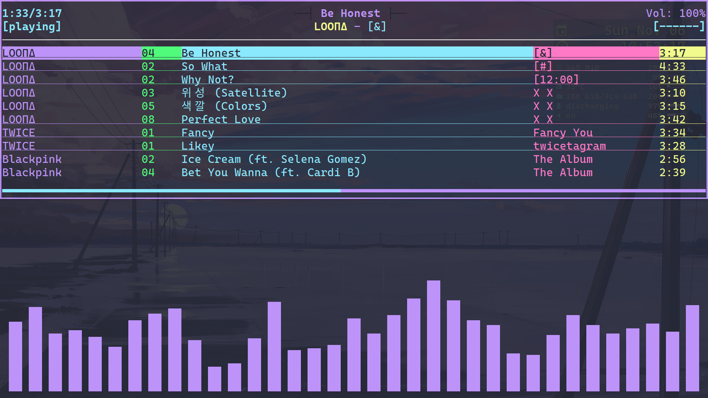

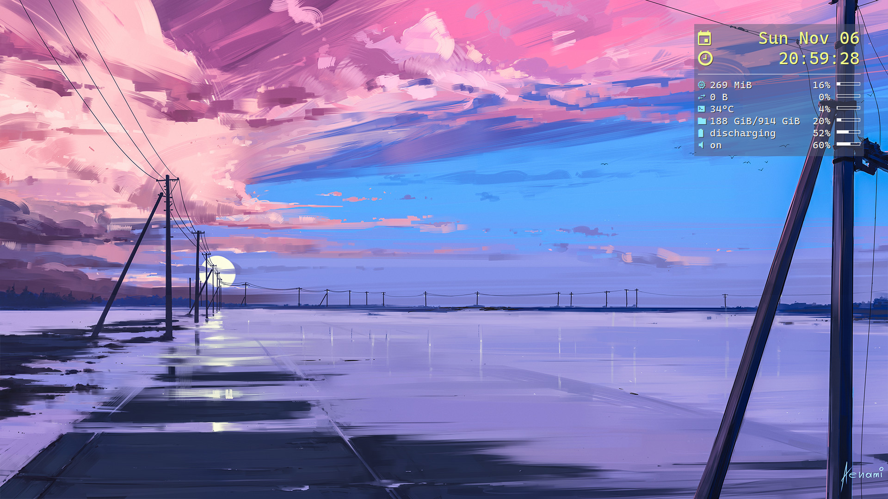

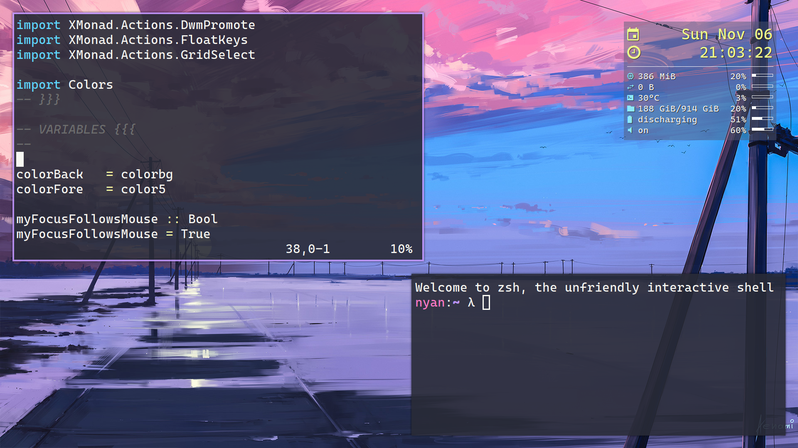

## Minimal i3

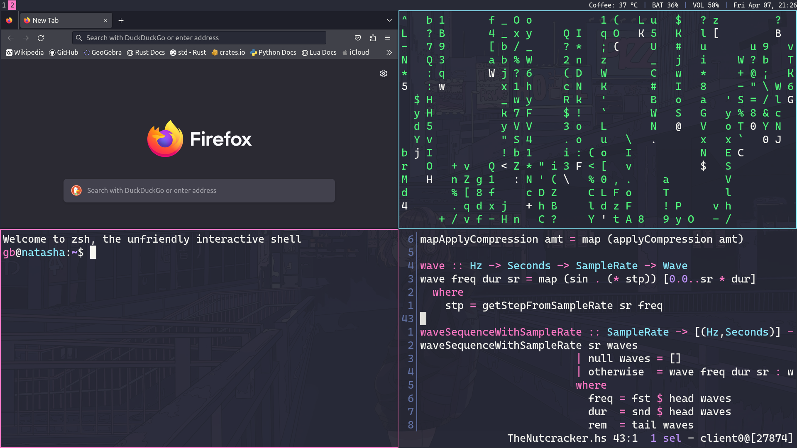

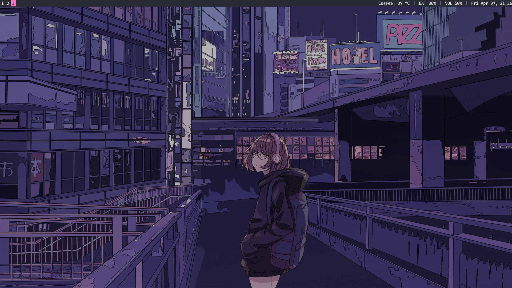

## Rin Shima XMonad

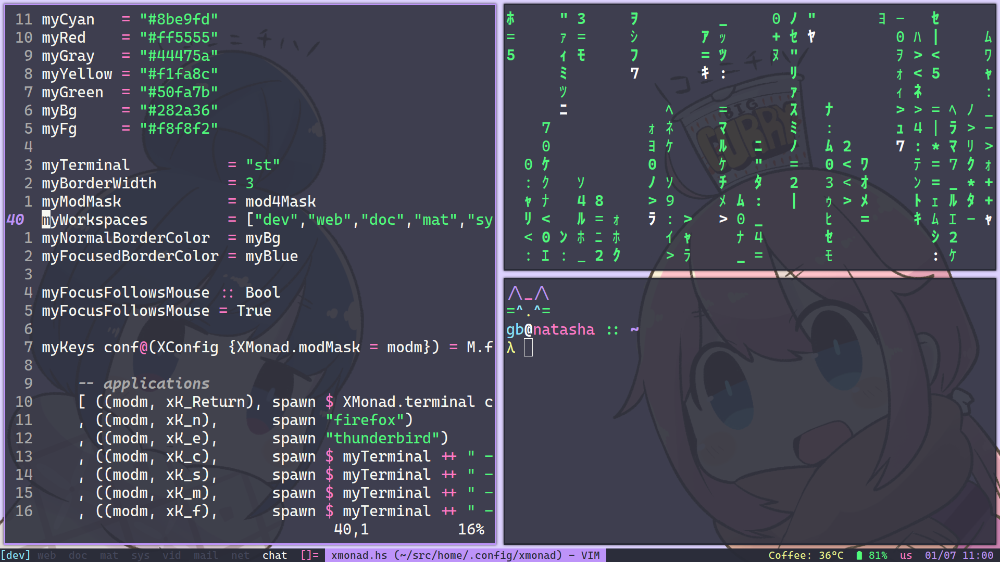
