#+TITLE: Πολιτικά
#+INDEX: Πολιτικά
#+DATE: <2025-02-10 Mon 21:43>
#+LANGUAGE: en

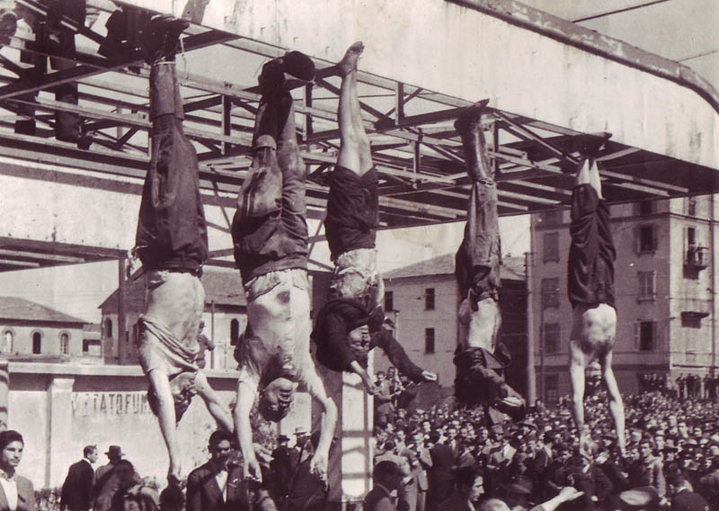 /Bombacci, Mussolini, Petacci, Pavolini and Starace are hanged upside-down at a gas station, 29 April 1945/

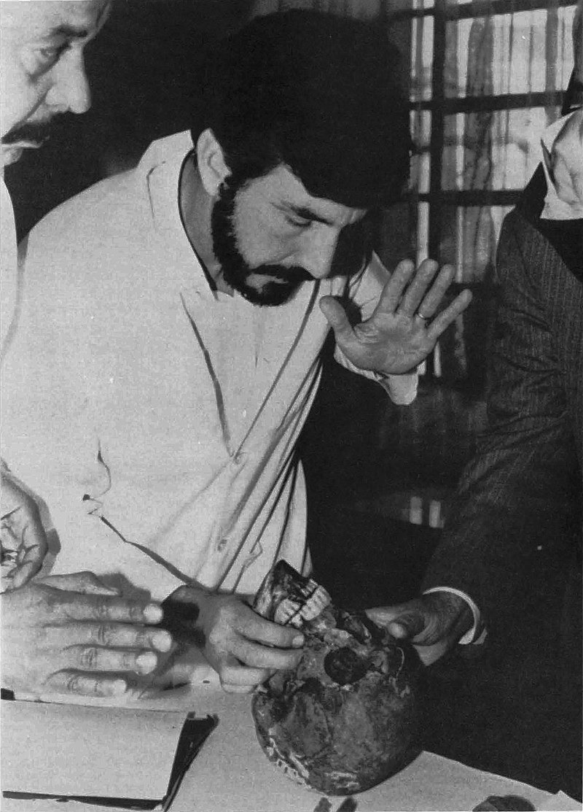 /Josef Mengele's skull is examined at Universidade de São Paulo, 1986/

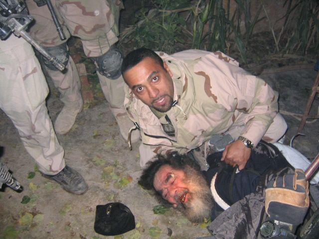 /Saddam Hussein is captured, 13 December, 2003/

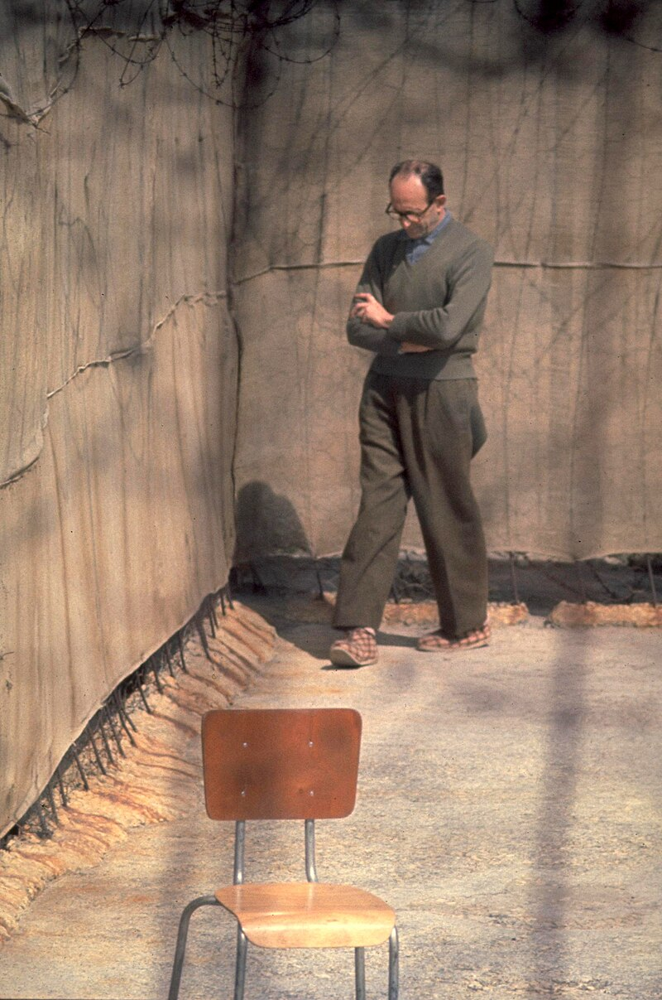 /Adolf Eichmann walks in the yard of Ayalon Prison, 1961/

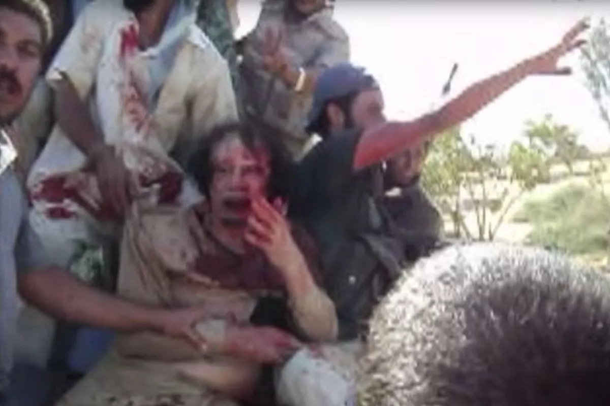 /Muammar Gaddafi begs for his life as he's captured, 20 October 2011/

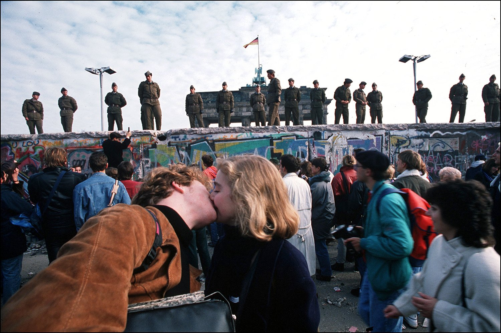 /A couple kisses during the Berlin Wall fall, 9 November, 1989/

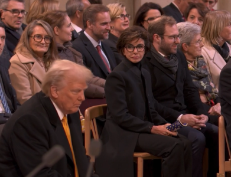 /Reaction to Donald Trump's arrival at the Réouverture de Notre-Dame, 7 December 2024/

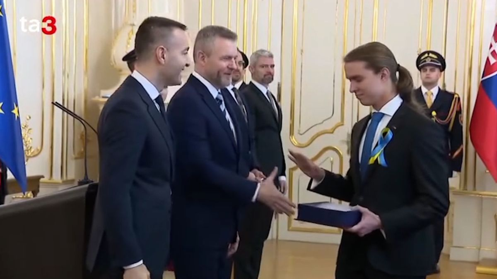 /Student refuses to shake slovak president Peter Pellegrini's hand, 13 January 2025/

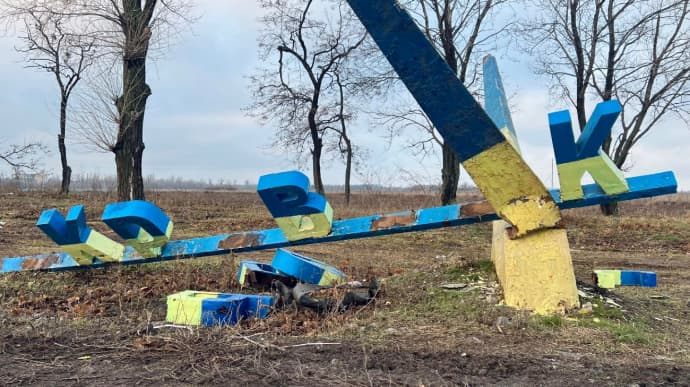 /Yellow-and-blue monument in Pokrovsk was destroyed by a ruzzian attack, 2 January 2025/

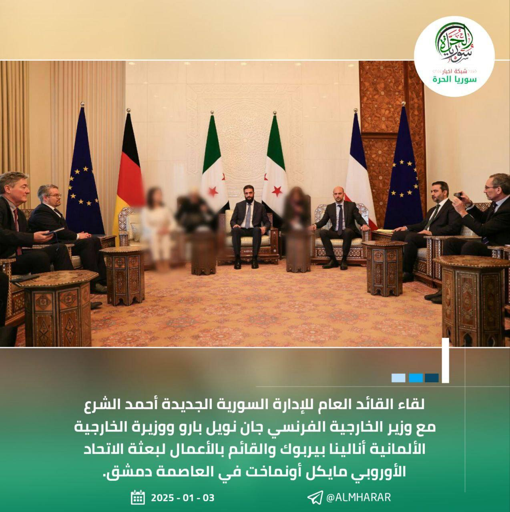 /Free Syria news network blurred german foreign minister Annalena Berbok along with two interprets because they're woman, 3 January 2025/

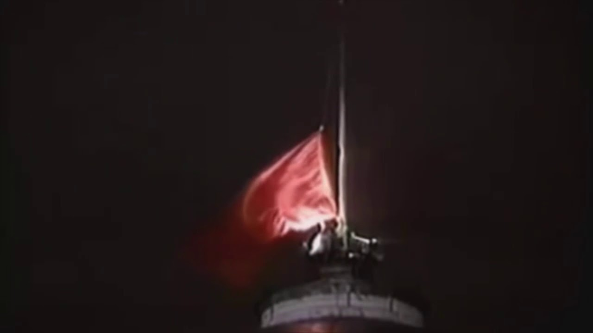 /The Soviet flag is lowered by the last time, 1991/
