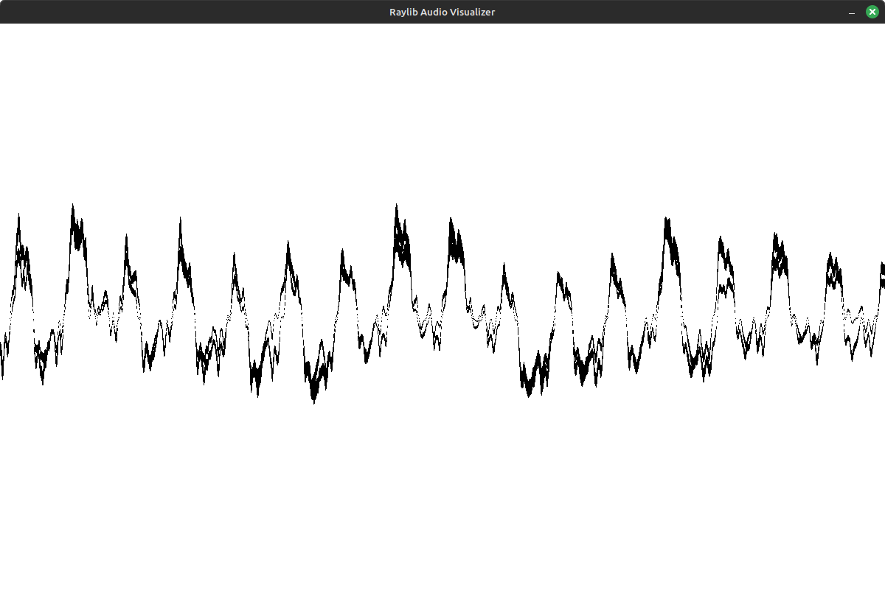
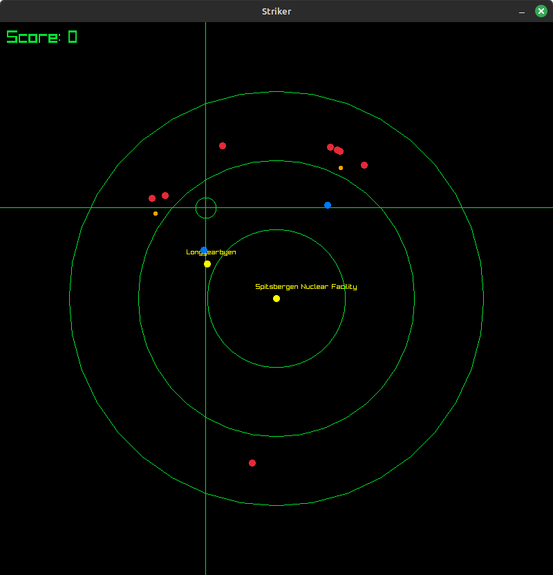
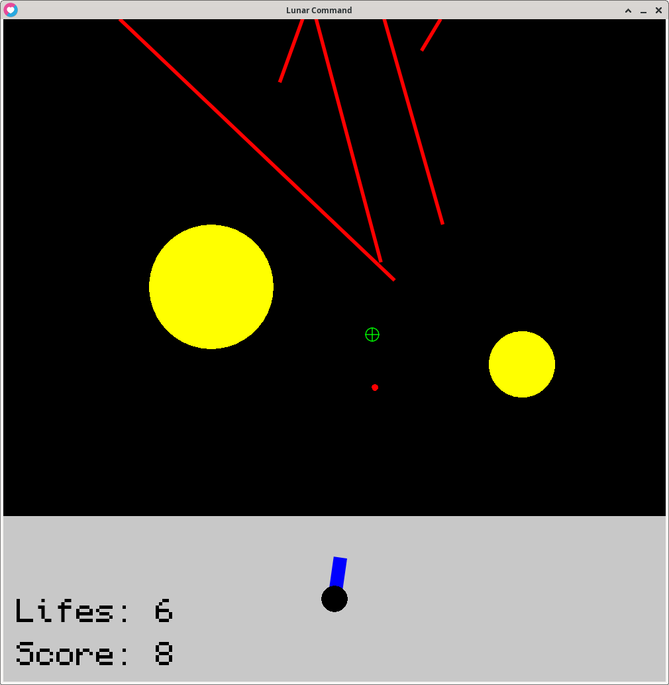
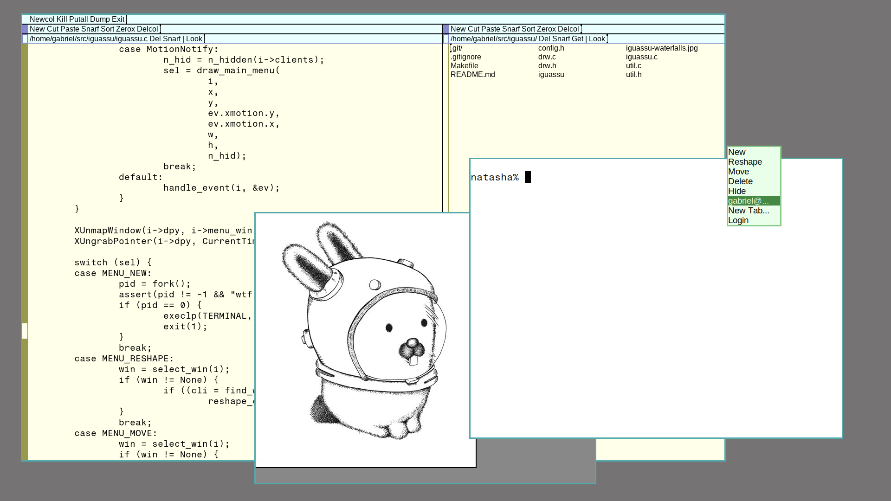
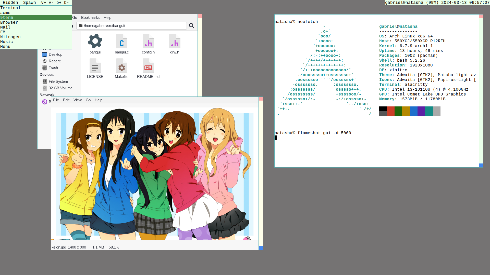

#+TITLE: Projects
#+OPTIONS: toc:1

 A (non-exaustive) list of my projects!

* EGG
Abreviation for "Emulador Genérico do Gabriel". EGG is an emulator tailored at computer science education, designed specifically with the needs of the Microcomputers classes at [[https://web.inf.ufpr.br/dinf/][UFPR]]. Supports RISC-V, MIPS and a fantasy architecture named Sagui.

*** Features
+ Internationalized interface, currently translated only for Portuguese.
+ Debugger with breakpoints, rewind, stepping and dump functionality.
+ Assembly syntax designed to help students.

EGG probably works in any system with virtual memory where Go also works.

+ [[https://github.com/gboncoffee/egg][Source code]]
+ [[https://github.com/gboncoffee/egg/releases][Binaries for Linux, Windows and Darwin]]

* Intergo

Small internationalization library for Go inspired by Gettext. Languages are stored in hashmaps and thus the library does not require any runtime file to work. Used for the internationalization in [[*EGG][EGG]].

+ [[https://github.com/gboncoffee/intergo][Source code]]
+ [[https://pkg.go.dev/github.com/gboncoffee/intergo][Documentation]]

* GGB86 - Gabriel's Good Bootloader for x86

Simple bootloader for x86 machines and the FAT 32 filesystem. Loads kernels from the boot disk, from reserved FAT 32 sectors to the `0x1000` address, switches to 32 bit protected mode and transfers control to the kernel.

+ [[https://github.com/gboncoffee/ggb86][Source Code]]

* Universal Makefile

The only Makefile you'll ever need. Automatically adds every C and C++ source file with it's own object, and manages release and debug build profiles. And if that's not good enough, it's released under public domain.

+ [[https://github.com/gboncoffee/c-infrastructure][Source Code]]

* pgm.h

Public domain single-header library for reading, manipulating and writing PGM images.

+ [[https://github.com/gboncoffee/pgm.h][Source Code]]

* Rave

Audio visualizer made with Raylib in C.

+ [[https://github.com/gboncoffee/rave][Source code]]

* b3.h

Definitions for [[https://www.b3.com.br/en_us/][B3]] FIX/SBE messages. Header-only library.

+ [[https://github.com/gboncoffee/b3.h][Source code]]

* FinTEx

Financial Technological Exchange. A small and fast matching-engine for research of market strategies and embedding.

+ [[https://github.com/gboncoffee/fintex][Source Code]]

* Striker

The Resistance remains in the Arctic Ocean. In the Spitsbergen Nuclear Facility, at the Svalbard Archipelago, near the town of Longyearbyen, you're under attack and needs to shoot down all enemy missiles. The Resistance needs your help fighting the Enemy.

+ [[https://github.com/gboncoffee/striker][Source code]]

* Lunar Command

Point-and-click Missile Command clone made with [[https://love2d.org/][LÖVE]].

+ [[https://github.com/gboncoffee/lunar-command][Source code]]

* Iguassu

~rio~ clone for X11.

Differences from Plan 9 From User Space rio:

+ Text rendering via Xft so TrueType support.
+ Configuration via source code only (config.h).
+ No compiled limits.
+ Three keybinds: one for fullscreen, one for reshaping and one for fixing bad rendered windows.
+ Additional menu on button 1 that shows all windows.

See the repo for more information.

+ [[https://github.com/gboncoffee/iguassu][Source code]]

* Barigui

Mouse-oriented dynamic window manager for X11.

It manages windows in a floating way by default, but windows may be put in a tiled "master-stack" layer, similar to [[https://dwm.suckless.org/][dwm]] but reversed. Windows may be hide and are controlled via a tiny bar at their side.

+ [[https://github.com/gboncoffee/barigui][Source code]]

* wwtobu

Acronym to "Window Waiting TO Be Useful".

This is a X window that display a bunch of labels which you can click to run commands. It also displays the name of the root window so it works as statusline with programs like slstatus.

That's all. It just sits there in your desktop waiting to be useful.

+ [[https://github.com/gboncoffee/wwtobu][Source code]]
